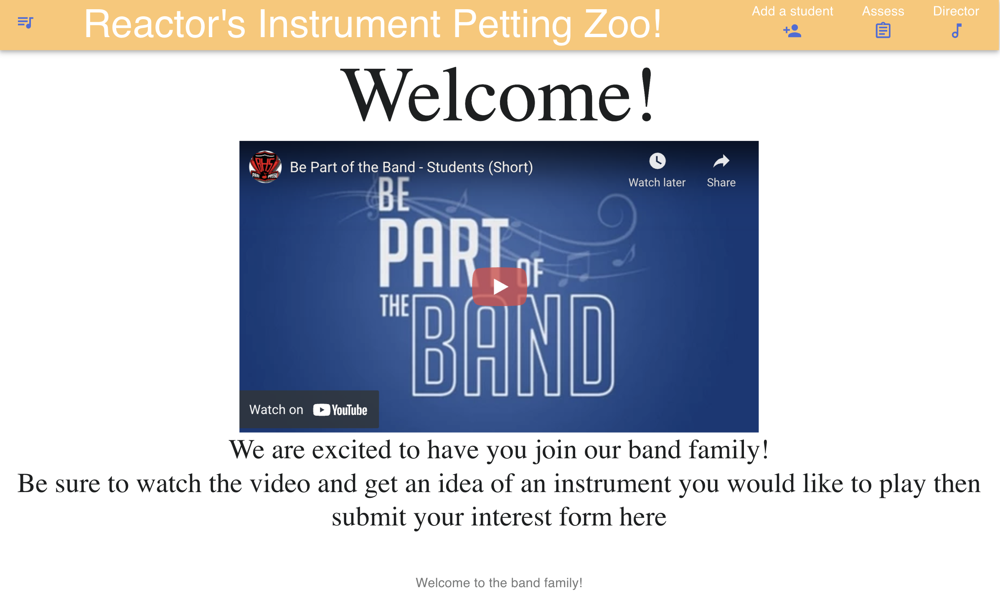
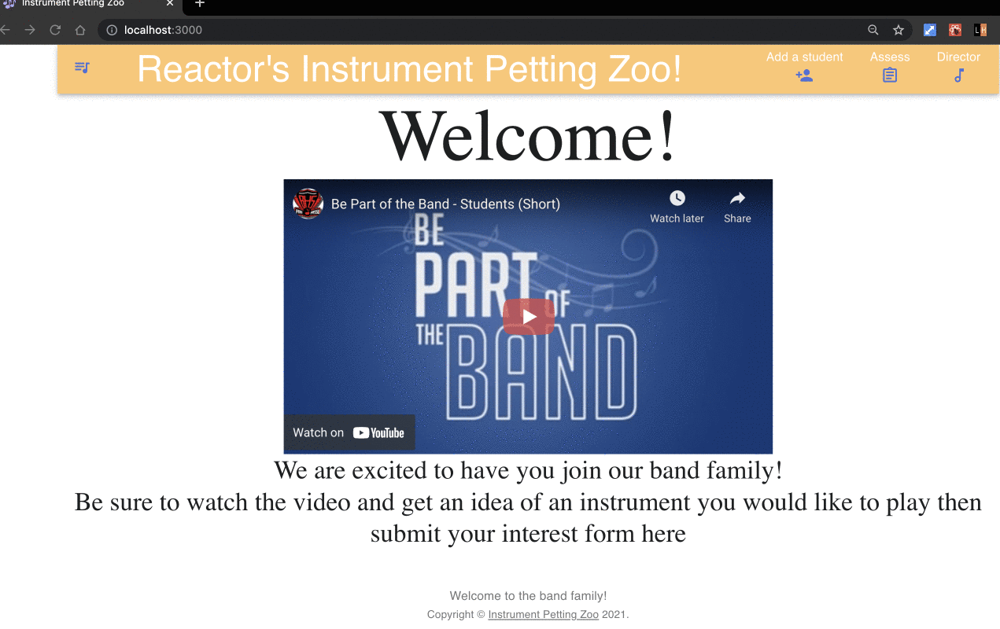
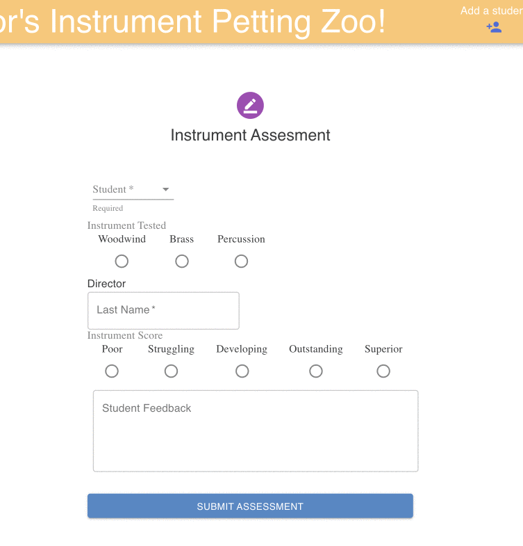
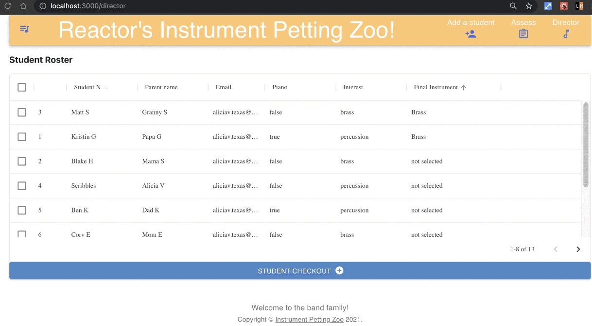

# 🎶 Instrument Petting Zoo 🎷

<br />

<h2 align="center"> Modernized Assessment and Program Management tools for the hard working band birector </h2>
<br>

<!-- TABLE OF CONTENTS -->
<details open="open">
  <summary>Table of Contents</summary>
  <ol>
    <li><a href="#contributor">Contributor</a></li>
    <li>
      <a href="#about-the-project">About The Project</a>
      <ul>
        <li><a href="#tech-stack">Built With</a></li>
      </ul>
    </li>
    <li>
      <a href="#getting-started">Getting Started</a>
      <ul>
        <li><a href="#prerequisites">Prerequisites</a></li>
        <li><a href="#installation">Installation</a></li>
      </ul>
    </li>
    <li><a href="#module-break-down">Module Break Down</a></li>
    <li><a href="#next-goals">Next Goals</a></li>
  </ol>
</details>
<br>

<!-- CONTACT -->

# Contributor

### Alicia Villanueva - aliciav.texas@gmail.com

 

[![linkedin-shield]][alicia-linkedin]
[![github-shield]][alicia-github]

[Project Repo](https://github.com/your_username/repo_name)
[Engineering Journal](https://docs.google.com/document/d/1-vkIBe606XtSPjh0UxGqYstZ-p_MBjhmspAfRdZBCHI/edit?usp=sharing)

<br>

<br>

<!-- ABOUT THE PROJECT -->

# About The Project

<br>
<div align="center">

</div><br><br>

Instrument Petting Zoo was a two-day challenge to create a Minimum Viable Product from an empty repo to Phase-One of a Full Stack Application. Emphasis was placed on learning advanced React techniques, form authentication and developing RESTful back-end services. IPZ is a web-application project that will continue to grow and develop towards a polished product.

<br>

# Overview

<br>

> "This project became a dream of mine when I was a college student first assessing incoming beginner band students. My hand was cramped from hours of writing notes on a student's sheet and I yearned to assess students more appropriately without the guilt of writing down a 1 out of 5 on their dream instrument. This thought remained with me into my official career as a band director and the process of assessing incoming beginners had not been improved. Band programs use an outdated system that requires families to register their students through a third-party application, require instrument assessors to use pencil and paper for student scores, and a final checkout process on a band program management application that the director must manually fill in the student's registered information and lastly their assessed scores. With this project, I aim to support hard-working directors by providing a modernized solution to this yearly process and relieving them greatly of the stress of this process. Allowing more time for the excitement and joy of placing a student on their very first band instrument."

<br>

### Tech Stack

- [React](https://reactjs.org/)
- [MaterialUI](https://mui.com/)
- [Axios](https://axios-http.com/)
- [Express](https://expressjs.com/)
- [Webpack](https://webpack.js.org/)

<br>

<!-- GETTING STARTED -->

# Getting Started

To explore the project, follow the instructions below.

### Prerequisites

This is an example of how to list things you need to use the software and how to install them.

- npm
  ```sh
  npm install npm@latest -g
  ```

### Installation

1. Have your API token available or generate a new one with github following this link [Generate Token](https://docs.github.com/en/authentication/keeping-your-account-and-data-secure/creating-a-personal-access-token)
2. Clone the repo
   ```sh
   git clone https://github.com/your_username_/Instrument-Petting-Zoo.git
   ```
3. Install NPM packages
   ```sh
   npm install
   ```
4. Enter your PostgresSQL API key in `config.example.js`
   ```JS
   module.exports = {
   host: 'localhost',
   password: 'PASSWORD'
   }
   ```
5. Remove the .example. from config.example.js to create config.js
   ```sh
    Reminder to NEVER push your config.js file!
   ```
6. Compile Webpack
   ```sh
    npm run build
   ```
7. Run express server on port: 3030
   ```sh
    npm run server
   ```
8. Navigate to `localhost:3000` in your browser

<br><br>

# Module Break Down

> ## Page Navigation
>
> React Router, Material UI

<br>
<div align="center">

</div><br><br>

React Router was implemented to create a seamless UI experience for families, assessors and directors. This implementation also granted time for async Database information to be returned and to populate the fields in the director page. <br><br>
Future features of this module include:

- Firebase autentication for student registration
- Log in page for directors
- Persist director log in with localStorage
- Firesbase storage for registered students

<br>

> ## Student Assessment
>
> Matierial UI

<br>

<div align="center">

</div><br><br>

<br>

# Form page for instrument assessors

This page provides anonymity and comfort for the assessor to submit clear and direct feedback on a student's performance in addition direct communication to the band director in the student feedback section.

- A dropdown list is rendered with registered students from the database.
- Radio buttons replicate the columns and ratings for a students assesment.
- On submit, fom data is collected and imported into the students row within Postgres. Instrument score is translated to a numeric rating on submit.

<br><br>

<div align="center">

</div><br><br>

> ## Director Page

<br>

The director page displays student information and assessment scores from the Posgres database. Student Roster page is used to displayed all registered students, basic contact information as well as their final instrument selction. The Final Checkout presents the student's numeric scores as well as the written feedback provided from the assessor.

- Seperation of routes allows for tables and fields to populate with updates to the Database without any asynchronous loading errors
- The Student Roster table is customized to filter on each column
- The student checkout updates the database on the selected student with their final instrument selection

## Next Goals

- Google Firebase User Authentication
- Persist User Log In Through Local Storage
- Email feedback to family
- Create an anonymous feedback for assessor that will not be placed on the email
- Refactor Back-End Services to a Mongo Atlas Instance for cloud database services
- Chat communication between assessors and directors

<!-- Contributor Links -->

[alicia-linkedin]: https://www.linkedin.com/in/alicia-villanueva-atx/
[alicia-github]: https://github.com/aliciav-texas
[linkedin-shield]: https://img.shields.io/badge/-LinkedIn-grey?style=for-the-badge&logo=linkedin
[github-shield]: https://img.shields.io/badge/-GitHub-grey?style=for-the-badge&logo=github
